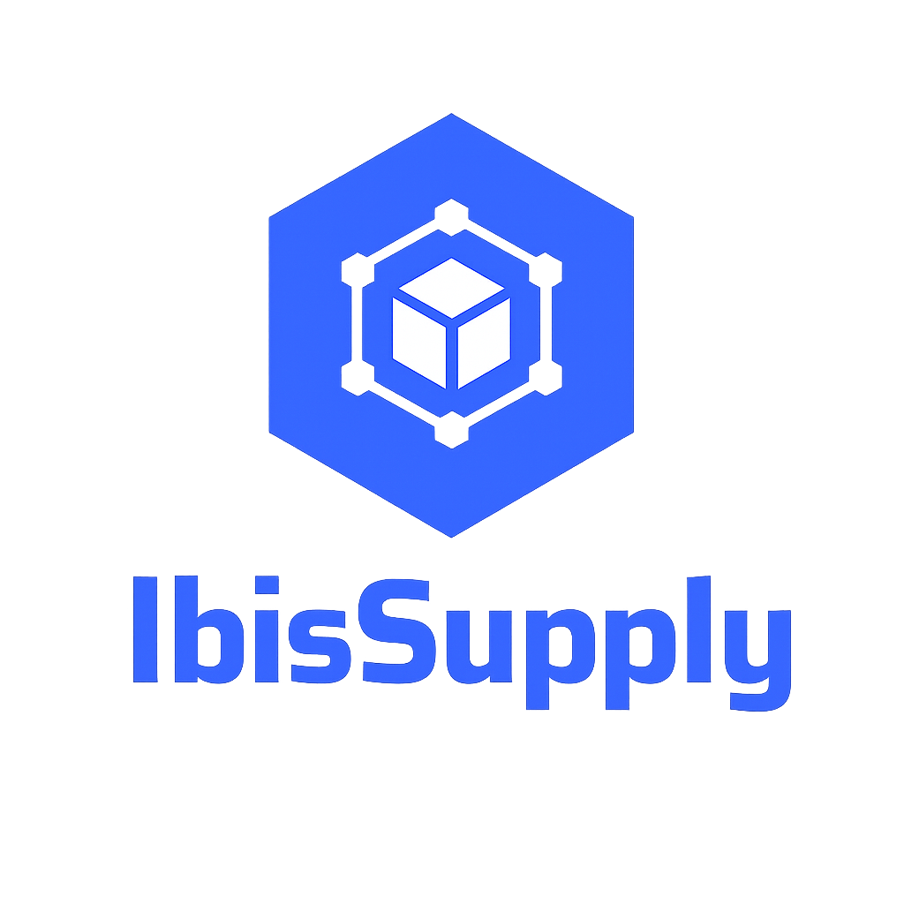

# IbisSupply — Blockchain-Tabanlı Gıda Tedarik Zinciri İzlenebilirlik Sistemi

<p align="center">
  
</p>

<p align="center">
  <b>Gıda ürünlerini üretimden tüketime kadar şeffaf, güvenilir ve değiştirilemez biçimde izleyin.</b>
</p>

<p align="center">
  
  
  
  
  
</p>

---

## Proje Hakkında

**IbisSupply**, gıda tedarik zincirindeki her aşamayı — üretim, depolama, taşıma, kalite kontrolü — Ethereum blockchain üzerinde kayıt altına alan, yapay zeka destekli anomali tespiti sunan bir izlenebilirlik platformudur.

> **Danışman:** Doç. Dr. Funda DEMİR  
> **Geliştirici:** Enes İBİŞ

---

## Özellikler

| Özellik | Açıklama |
|---|---|
| **Blockchain Kaydı** | Her batch, sevkiyat ve kalite kontrolü Ethereum üzerinde TX hash ile kayıt altına alınır |
| **QR İzlenebilirlik** | Ürün üzerindeki QR kod taranarak tam tedarik zinciri geçmişi görüntülenir |
| **AI Anomali Tespiti** | RandomForest + kural tabanlı hibrit model ile sıcaklık anomalisi ve risk skoru hesaplar |
| **Rol Tabanlı Erişim** | Admin, Üretici, Lojistik, Denetçi, Müşteri rolleri — JWT ile güvenli kimlik doğrulama |
| **Gerçek Zamanlı Olaylar** | Sevkiyat checkpoint, sıcaklık logu, teslimat olayları zincire yazılır |
| **Dark Glassmorphism UI** | Modern dark navy + cam efekti Flutter arayüzü |

---

## Mimari

```
┌─────────────────────────────────────────────────────┐
│                  Flutter Mobile App                 │
│         (go_router • flutter_bloc • dio)            │
└──────────────────────┬──────────────────────────────┘
                       │ REST API (JWT)
┌──────────────────────▼──────────────────────────────┐
│              Spring Boot 3.3 Backend                │
│         (Java 21 • PostgreSQL • Web3j)              │
└───────────┬──────────────────────┬──────────────────┘
            │ RPC                  │ HTTP
┌───────────▼──────┐   ┌───────────▼──────────────────┐
│  Hardhat / EVM   │   │   FastAPI AI Servisi          │
│  (Solidity 0.8)  │   │   (scikit-learn • Python 3)  │
└──────────────────┘   └──────────────────────────────┘
```

### Akıllı Kontratlar (Solidity)

| Kontrat | Açıklama |
|---|---|
| `RoleManager.sol` | Blockchain tarafında rol yönetimi |
| `BatchRegistry.sol` | Ürün batch kayıtları |
| `ShipmentRegistry.sol` | Sevkiyat + teslimat olayları |
| `QualityRegistry.sol` | Kalite kontrol kayıtları |

---

## Teknoloji Yığını

| Katman | Teknoloji |
|---|---|
| **Backend** | Spring Boot 3.3, Java 21, PostgreSQL, JWT, Web3j |
| **Blockchain** | Solidity 0.8.28, Hardhat (Chain 31337) |
| **Mobile** | Flutter, go_router, flutter_bloc, dio, mobile_scanner |
| **AI** | Python 3.14, FastAPI, scikit-learn (RandomForest) |

---

## Kurulum & Çalıştırma

### Gereksinimler

- Java 21+
- Node.js 18+ (Hardhat için)
- Flutter 3.x
- Python 3.11+
- PostgreSQL 14+

### 1. Blockchain Node

```bash
cd blockchain
npm install
npx hardhat node                                          # Terminal 1'de açık kalmalı
npx hardhat run scripts/deploy.js --network localhost    # Deploy
```

Çıkan kontrat adreslerini `backend/src/main/resources/application.yml` dosyasına yazın.

### 2. AI Servisi

```bash
cd ai
python -m pip install -r requirements.txt
python -m uvicorn main:app --port 8000    # Terminal 2
```

### 3. Backend

```bash
cd backend
mvn clean package -DskipTests
java -jar target/backend-0.0.1-SNAPSHOT.jar    # Terminal 3
```

### 4. Flutter

```bash
cd mobile
flutter pub get
flutter run
```

---

## API Endpoint'leri

| Method | Endpoint | Açıklama |
|---|---|---|
| `POST` | `/api/v1/auth/login` | Giriş, JWT token |
| `GET/POST` | `/api/v1/batches` | Batch listesi / oluşturma |
| `GET/POST` | `/api/v1/shipments` | Sevkiyat listesi / oluşturma |
| `POST` | `/api/v1/shipments/{id}/events` | Olay ekle (checkpoint, sıcaklık vb.) |
| `PUT` | `/api/v1/shipments/{id}/deliver` | Teslimat tamamla |
| `GET` | `/api/v1/shipments/{id}/anomaly` | AI anomali analizi |
| `GET/POST` | `/api/v1/quality-checks` | Kalite kontrol |
| `GET` | `/api/v1/trace/qr/{qrCode}` | QR ile ürün sorgula (public) |
| `GET` | `/api/v1/trace/batch/{batchCode}` | Batch kodu ile sorgula |

---

## Test Kullanıcıları

| E-posta | Şifre | Rol |
|---|---|---|
| admin@ibissupply.com | admin123 | ADMIN |
| producer@ibissupply.com | producer123 | PRODUCER |

---

## Demo Senaryosu

**"Organik Çilek" — Uçtan Uca Akış**

1. **Üretici giriş yapar** → `producer@ibissupply.com`
2. **Batch oluşturur** → Organik Çilek, 300 KG, İzmir → Blockchain TX hash üretilir
3. **Sevkiyat başlatır** → İzmir → İstanbul → TX hash üretilir
4. **AI anomali kontrolü** → Risk seviyesi: LOW / MEDIUM / HIGH / CRITICAL
5. **Batch detayındaki QR taranır** → Tüm tedarik zinciri geçmişi görüntülenir

---

## Yapı

```
IbisSupply/
├── backend/          # Spring Boot uygulaması
│   └── src/main/java/com/ibissupply/backend/
│       ├── controller/   # REST controller'lar
│       ├── service/      # İş mantığı (Blockchain, AI bridge dahil)
│       ├── entity/       # JPA entity'leri
│       └── dto/          # Request / Response DTO'ları
├── blockchain/       # Hardhat projesi
│   ├── contracts/    # Solidity akıllı kontratlar
│   └── scripts/      # Deploy script'leri
├── mobile/           # Flutter uygulaması
│   └── lib/
│       ├── core/     # API client, router, tema
│       └── features/ # Auth, Batch, Shipment, Quality, Admin, QR
└── ai/               # FastAPI + scikit-learn
    ├── main.py       # Endpoint'ler
    └── anomaly_model.py  # RandomForest modeli
```

---
---

<p align="center">
  Geliştirici: <b>Enes İBİŞ</b> — Karabük Üniversitesi BBSF<br/>
  Danışman: <b>Doç. Dr. Funda DEMİR</b>
</p>
